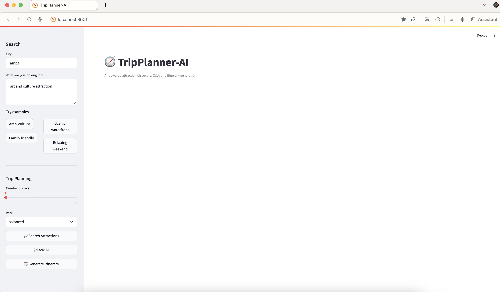
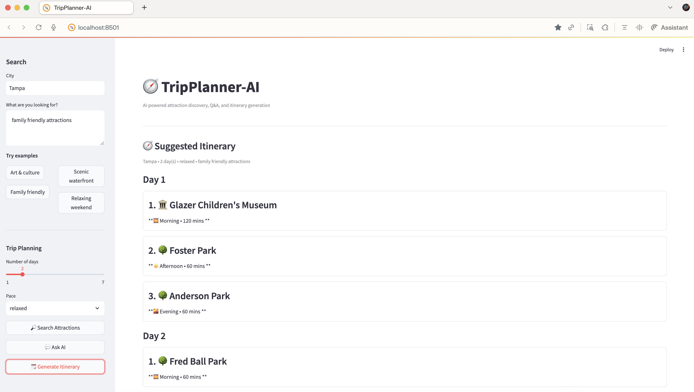
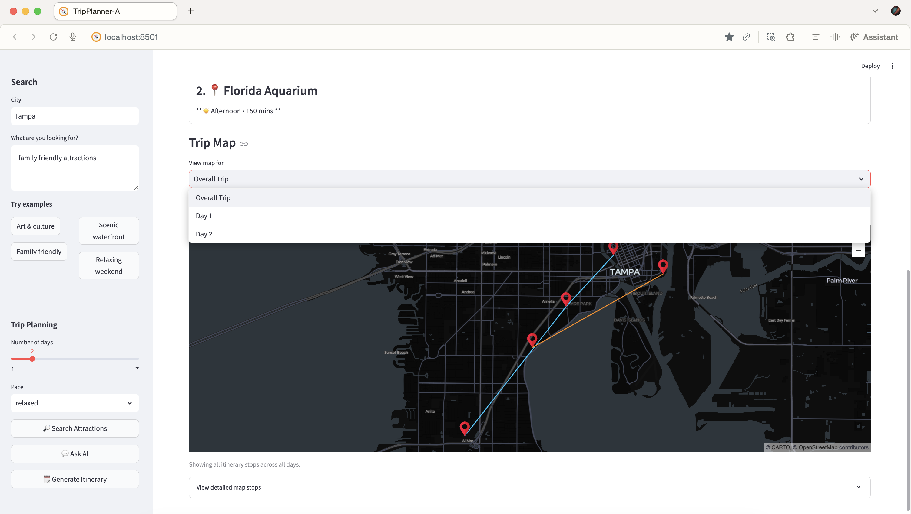
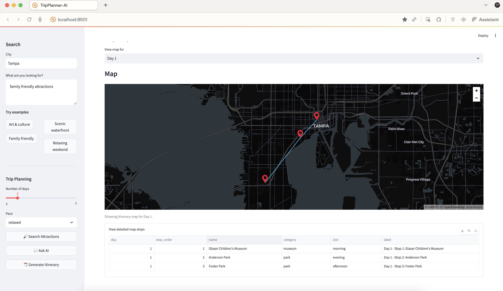

=======
# TripPlanner-AI

**AI-powered travel planner using semantic search, itinerary generation, and map visualization.**

TripPlanner-AI helps users discover attractions based on travel intent and generates structured multi-day itineraries.

---

## Features

- Semantic attraction search by user intent
- Day-wise itinerary generation
- Multi-day trip planning
- Interactive map visualization
- FastAPI backend + Streamlit frontend

---

## Screenshots

### Home / Search


### Itinerary View


### Map View


### Expanded Stops (Details)


---

## Tech Stack

- Python, FastAPI, Streamlit
- OpenAI embeddings
- Qdrant vector database
- OpenStreetMap + Wikipedia data

---
<strong> Limitations: </strong>
- Search relevance needs refinement for some query types
- Similar place types can dominate results (e.g., many parks)
- Yelp data and popularity signals not yet integrated
- Weather-aware planning not implemented

---
<strong> Roadmap: </strong>
- Improve ranking and diversity
- Integrate Yelp data
- Add RAG-based trip assistant
- Add weather-aware itinerary planning

---
Author:
- Divya Rajaraman

---
## Setup

```bash
git clone https://github.com/divgit3/tripplanner-ai.git
cd tripplanner-ai

python -m venv .venv
source .venv/bin/activate
pip install -r requirements.txt

uvicorn api.main:app --reload --port 8001
streamlit run ui/app.py


